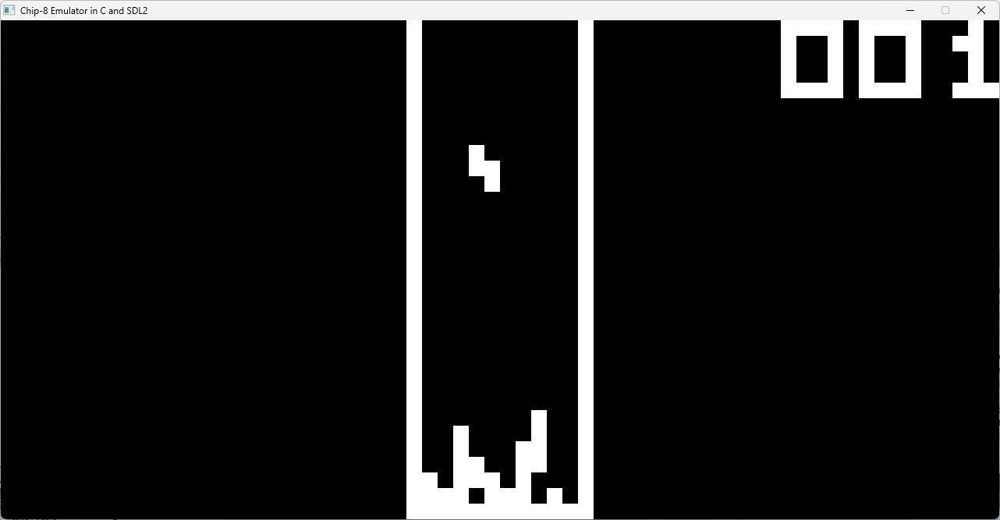
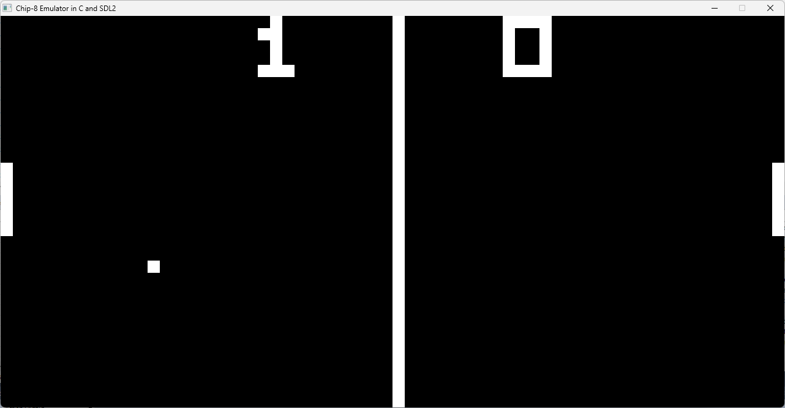

<div align="center">
<h1> Chip-8 Emulator </h1>
<h4> A Chip-8 Emulator written in C and SDL2. </h4>
<br>
</div>

Personal attempt at emulation development, not an accurate emulator.

_CHIP-8 is an interpreted programming language developed by Joseph Weisbecker in the 1970s. It was made to allow video games to be more easily programmed for 8-bit microcomputers at the time, and runs on a CHIP-8 virtual machine._

## Screenshots



## Release Notes (0.1.0-rc)

**Status:** Pre-release (functional, but not complete)

**Implemented Features**
  + Entire Chip-8 instruction set
  + SDL2 rendering and keyboard input
  + Support for static Windows binaries

**Missing Features**
  + Audio output
  + Color palette switching
  + Pausing and reset functionality
  + SuperChip / XO-Chip support

## Building

### Dependencies

+ **C Compiler**
  + **Linux:** GCC version 9.0+
  + **Windows:** [MinGW-w64](https://www.msys2.org/) GCC 9.0+

+ **SDL2**
  + Install for your platform: https://wiki.libsdl.org/SDL2/Installation


If you are on Windows install these packages inside of MSYS2 MinGW64.
```sh
pacman -S mingw-w64-x86_64-make mingw-w64-x86_64-gcc mingw-w64-x86_64-SDL2
```

### Compiling

> [!Caution]
> If you are on Windows, open the MSYS2 MinGW64 Shell and execute the following commands.

**Windows and Linux**
```sh
$ ./build release # creates a statically linked binary on windows
```
The binary and its checksum are then in the ```bin/``` folder

## Usage
```sh
$ ./chip8 <rom>
```
On Windows the binary is statically linked and executable on any system, just drag any Chip-8 compatible rom into the .exe

### Binary Verification

Each release provides a checksum file in ```bin/```

```sh
$ sha1sum bin/<executable>
```

Compare this output with the given .sha1sum to verify file integrity

## Keyboard Layout:

### Chip8 Keypad:
|   |   |   |   |
|---|---|---|---|
| 1 | 2 | 3 | C |
| 4 | 5 | 6 | D |
| 7 | 8 | 9 | E |
| A | 0 | B | F |

### Emulator Keyboard Mapping:
|   |   |   |   |
|---|---|---|---|
| 1 | 2 | 3 | 4 |
| Q | W | E | R |
| A | S | D | F |
| Z | X | C | V |
